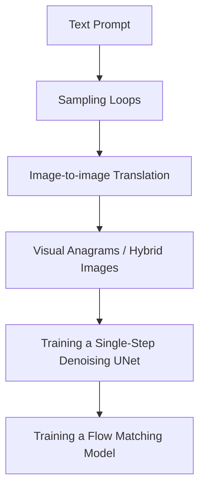
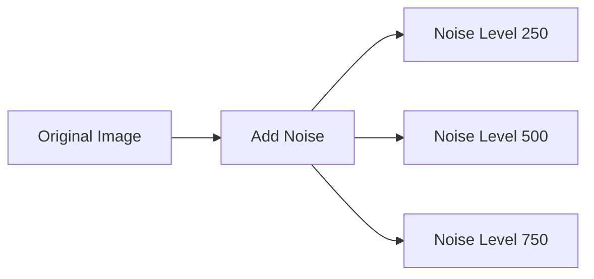
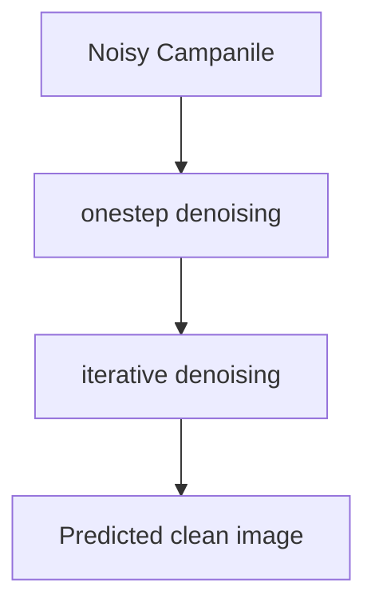
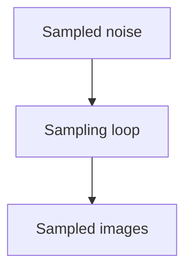
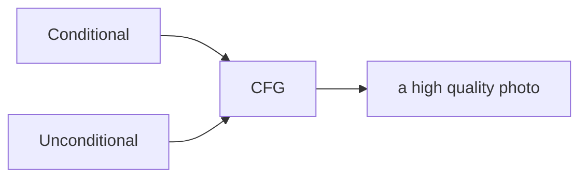
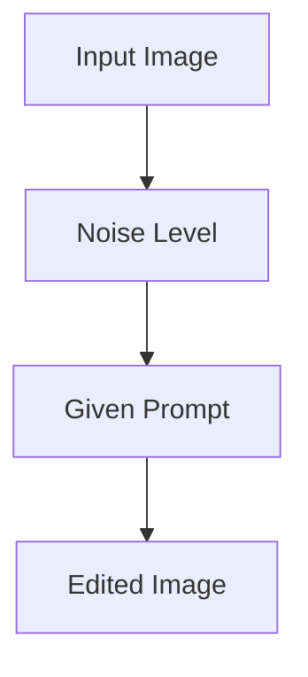
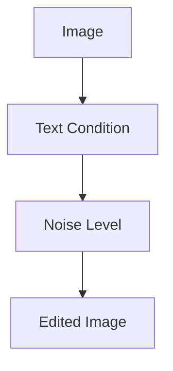
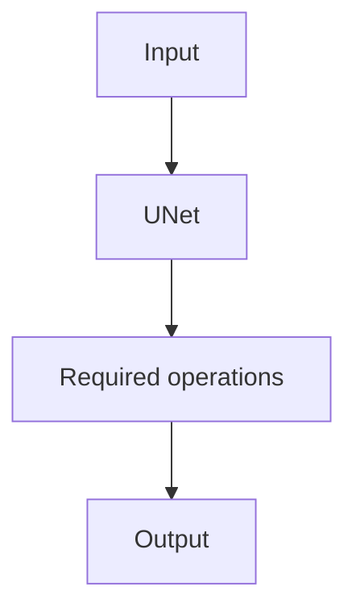
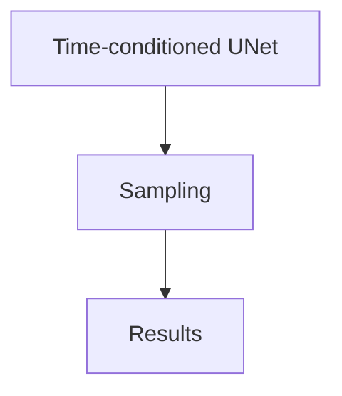
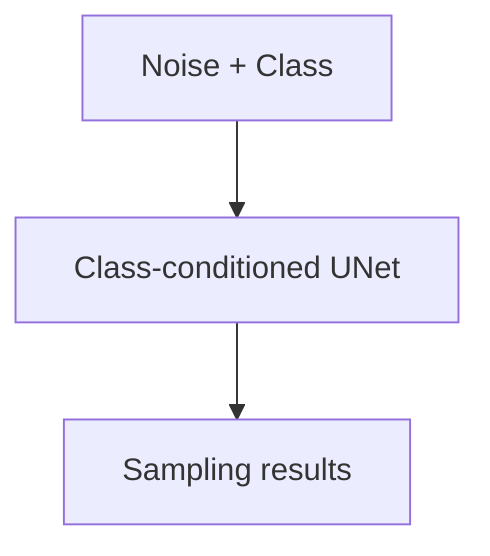

# Fun With Diffusion Models

In this project, we will be exploring the use and training of diffusion models.

---

## Part 0: Step

My text prompts are: ['an oil painting of a snowy mountain village',
'a photo of the amalfi cost',
'a photo of a man',
'a photo of a hipster barista',
'a photo of a dog',
'an oil painting of people around a campfire',
'an oil painting of an old man',
'a lithograph of waterfalls',
'a lithograph of a skull',
'a man wearing a hat',
'a high quality photo',
'',
'a rocket ship',
'a pencil'].
My seed is 100.

| 20 inference steps | 100 inference steps |
| :---: | :---: |
|  |  |

| 20 inference steps | 100 inference steps |
| :---: | :---: |
|  |  |

| 20 inference steps | 100 inference steps |
| :---: | :---: |
|  |  |

Inspecting all of these results, we can see that each image is a pretty solid representation of their associated prompt. One thing we can notice is that as the number of inference steps increase, the detail also starts to increase in the resulting image. This is especially noticable with the prompt 'a photo of the amalfi cost', and how it's buildings are much more intricate.

---

## Part 1: Sampling Loops

### Part 1.1: Implementing the Forward Process

| Noise Level 250 | Noise Level 500 | Noise Level 750 |
| :---: | :---: | :---: |
|  |  |  |

---

### Part 1.2: Classical Denoising

| Noise Level 250 | Denoised Level 250 |
| :---: | :---: |
|  |  |

| Noise Level 500 | Denoised Level 500 |
| :---: | :---: |
|  |  |

| Noise Level 750 | Denoised Level 750 |
| :---: | :---: |
|  |  |

---

### Part 1.3: One-Step Denoising

| Original Campinile | Campinile with Noise Level 250 |
| :---: | :---: |
|  |  |

| Predicted Noise for Level 250 | Denoised Campinile with Noise Level 250 |
| :---: | :---: |
|  |  |

| Original Campinile | Campinile with Noise Level 500 |
| :---: | :---: |
|  |  |

| Predicted Noise for Level 500 | Denoised Campinile with Noise Level 500 |
| :---: | :---: |
|  |  |

| Original Campinile | Campinile with Noise Level 750 |
| :---: | :---: |
|  |  |

| Predicted Noise for Level 750 | Denoised Campinile with Noise Level 750 |
| :---: | :---: |
|  |  |

---

### Part 1.4: Iterative Denoising

| Predicted clean image using gaussian blurring. | Predicted clean image using onestep denoising. | Predicted clean image using iterative denoising |
| :---: | :---: | :---: |
|  |  |  |

Here is the noisy Campanile every 5th loop of denoising.

| 690 | 540 | 390 | 240 | 90 |
| :---: | :---: | :---: | :---: | :---: |
|  |  |  |  |  |

---

### Part 1.5: Diffusion Model Sampling

Here are 5 sampled images.

| Image 1 | Image 2 | Image 3 | Image 4 | Image 5 |
| :---: | :---: | :---: | :---: | :---: |
|  |  |  |  |  |

---

### Part 1.6: Classifier-Free Guidance (CFG)

Here are 5 images of "a high quality photo" with a CFG scale of gamma = 7.

| Image 1 | Image 2 | Image 3 | Image 4 | Image 5 |
| :---: | :---: | :---: | :---: | :---: |
|  |  |  |  |  |

---

### Part 1.7: Image-to-image Translation

Here are edits of the Campanile image using the given prompt at various noise levels.

| Noise Level 1 | Noise Level 3 | Noise Level 5 |
| :---: | :---: | :---: |
|  |  |  |

| Noise Level 7 | Noise Level 10 | Noise Level 20 |
| :---: | :---: | :---: |
|  |  |  |

| Original Campanile Image |
| :---: |
|  |

Here are edits of an image of porridge using the given prompt at various noise levels.

| Noise Level 1 | Noise Level 3 | Noise Level 5 |
| :---: | :---: | :---: |
|  |  |  |

| Noise Level 7 | Noise Level 10 | Noise Level 20 |
| :---: | :---: | :---: |
|  |  |  |

| Original Porridge Image |
| :---: |
|  |

Here are edits of an image of a sitting cat using the given prompt at various noise levels.

| Noise Level 1 | Noise Level 3 | Noise Level 5 |
| :---: | :---: | :---: |
|  |  |  |

| Noise Level 7 | Noise Level 10 | Noise Level 20 |
| :---: | :---: | :---: |
|  |  |  |

| Original Cat Image |
| :---: |
|  |

---

### Part 1.7.1: Editing Hand-Drawn and Web Images

Here is a hand-drawn image edited using the given prompt at various noise levels.

| Original Hand-Drawn Image 1 | Noise Level 1 | Noise Level 3 | Noise Level 5 |
| :---: | :---: | :---: | :---: |
|  |  |  |  |

| Noise Level 7 | Noise Level 10 | Noise Level 20 |
| :---: | :---: | :---: |
|  |  |  |

Here is a hand-drawn image edited using the given prompt at various noise levels.

| Original Hand-Drawn Image 2 | Noise Level 1 | Noise Level 3 | Noise Level 5 |
| :---: | :---: | :---: | :---: |
|  |  |  |  |

| Noise Level 7 | Noise Level 10 | Noise Level 20 |
| :---: | :---: | :---: |
|  |  |  |

Here is an image from the web edited using the given prompt at various noise levels.

| Original Web Image | Noise Level 1 | Noise Level 3 | Noise Level 5 |
| :---: | :---: | :---: | :---: |
|  |  |  |  |

| Noise Level 7 | Noise Level 10 | Noise Level 20 |
| :---: | :---: | :---: |
|  |  |  |

---

### Part 1.7.2: Inpainting

| Campanile Inpainted | Hand-Drawn Image 1 Inpainted | Hand-Drawn Image 2 Inpainted |
| :---: | :---: | :---: |
|  |  |  |

---

### Part 1.7.3: Text-Conditional Image-to-image Translation

Here are edits of the Campanile edited using the given prompt at various noise levels.

| Original Campanile | Noise Level 1 | Noise Level 3 | Noise Level 5 |
| :---: | :---: | :---: | :---: |
|  |  |  |  |

| Noise Level 7 | Noise Level 10 | Noise Level 20 |
| :---: | :---: | :---: |
|  |  |  |

Here are edits of a hand-drawn image edited using the given prompt at various noise levels.

| Original Hand-Drawn Image 1 | Noise Level 1 | Noise Level 3 | Noise Level 5 |
| :---: | :---: | :---: | :---: |
|  |  |  |  |

| Noise Level 7 | Noise Level 10 | Noise Level 20 |
| :---: | :---: | :---: |
|  |  |  |

Here are edits of a hand-drawn image edited using the given prompt at various noise levels.

| Original Hand-Drawn Image 2 | Noise Level 1 | Noise Level 3 | Noise Level 5 |
| :---: | :---: | :---: | :---: |
|  |  |  |  |

| Noise Level 7 | Noise Level 10 | Noise Level 20 |
| :---: | :---: | :---: |
|  |  |  |

---

### Part 1.8: Visual Anagrams

| 'an oil painting of people around a campfire' and 'an oil painting of an old man' | 'a lithograph of waterfalls' and an oil painting of a snowy mountain village' |
| :---: | :---: |
|  |  |

---

### Part 1.9: Hybrid Images

| 'a photo of a dog' and 'a photo of the amalfi cost' | 'a rocket ship' and 'a man wearing a hat' |
| :---: | :---: |
|  |  |

---

## Part B

## Part 1: Training a Single-Step Denoising UNet

### 1.1 Implementing the UNet

Using PyTorch, I implemented this UNet, along with it's required operations.

| UNet |
| :---: |
|  |

---

### 1.2 Using the UNet to Train a Denoiser

Here is a visualization of the noising process using various sigma values.

| The noising process. |
| :---: |
|  |

#### 1.2.1 Training

| Training loss curve plot with a sigma value of 0.5. |
| :---: |
|  |

| Sample results on the test set with noise level 0.5 after 1 epoch. | Sample results on the test set with noise level 0.5 after 5 epochs. |
| :---: | :---: |
|  |  |

#### 1.2.2 Out-of-Distribution Testing

| Sample results on out-of-distribution noise levels with various sigma values. |
| :---: |
|  |

#### 1.2.3 Denoising Pure Noise

| Training loss curve plot with a sigma value of 0.5. |
| :---: |
|  |

| Results on pure noise after 1 epoch. | Results on pure noise after 5 epochs. |
| :---: | :---: |
|  |  |

Overall, as we continue to train, we see that the model is learning that images should generally look less like noise. However, we can see a patch of pixels that aren't "smooth" after 5 epochs. This could potentially be due to spatial bias in the dataset, with subjects in our training images roughly being centered, but slightly offset. So, the model could be learning that certain regions constistently exhibit higher-frequency content. This could then manifest iteself the patch of high frequency pixels when evaluated on OOD noise, as it has learned that subjects are usually placed in that region.

---

## Part 2: Training a Flow Matching Model

### 2.1 Adding Time Conditioning to UNet

To add time conditioning to a UNET, we need to implement a new operater called an FCBlock (fully-connected block) that is used to inject the conditioning signal into the UNet.

| FCBlock for conditioning |
| :---: |
|  |

---

### 2.2 Training the UNet

| Training loss curve plot for the time-conditioned UNet over the whole training process. |
| :---: |
|  |

---

### 2.3 Sampling from the UNet

| Sampling results from the time-conditioned UNet for 1 epoch. |
| :---: |
|  |

| Sampling results from the time-conditioned UNet for 5 epochs. |
| :---: |
|  |

| Sampling results from the time-conditioned UNet for 10 epochs. |
| :---: |
|  |

---

### 2.4 Adding Class-Conditioning to UNet

We can add class-conditioning to the UNet using a one-hot class-conditioning vector.

---

### 2.5 Training the Class-Conditioned UNet

| Training loss curve plot for the class-conditioned UNet over the whole training process. |
| :---: |
|  |

---

### 2.6 Sampling from the Class-Conditioned UNet

| Sampling results from the class-conditioned UNet for 1 epoch. |
| :---: |
|  |

| Sampling results from the class-conditioned UNet for 5 epochs. |
| :---: |
|  |

| Sampling results from the class-conditioned UNet for 10 epochs. |
| :---: |
|  |

Since class-conditioning allows us to converge facter, we can also remove the learning rate scheduler. In order to compensate for the loss of the scheduler can lower our constant learning rate by a factor of 10 (from 1e-2->1e-3).

| Sampling results from the class-conditioned UNet for 1 epoch w/ no scheduler. |
| :---: |
|  |

| Sampling results from the class-conditioned UNet for 5 epochs w/ no scheduler. |
| :---: |
|  |

| Sampling results from the class-conditioned UNet for 10 epochs w/ no scheduler. |
| :---: |
|  |