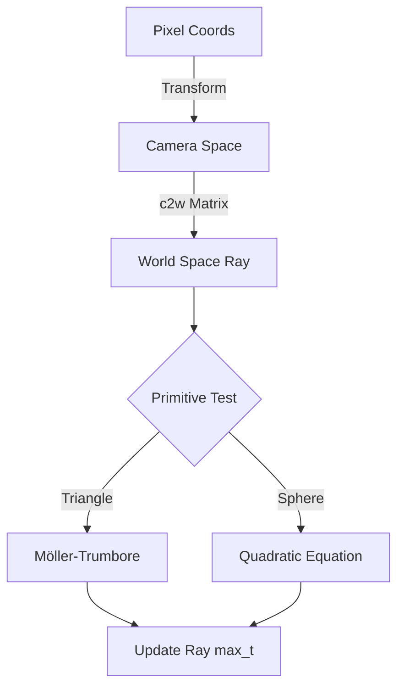
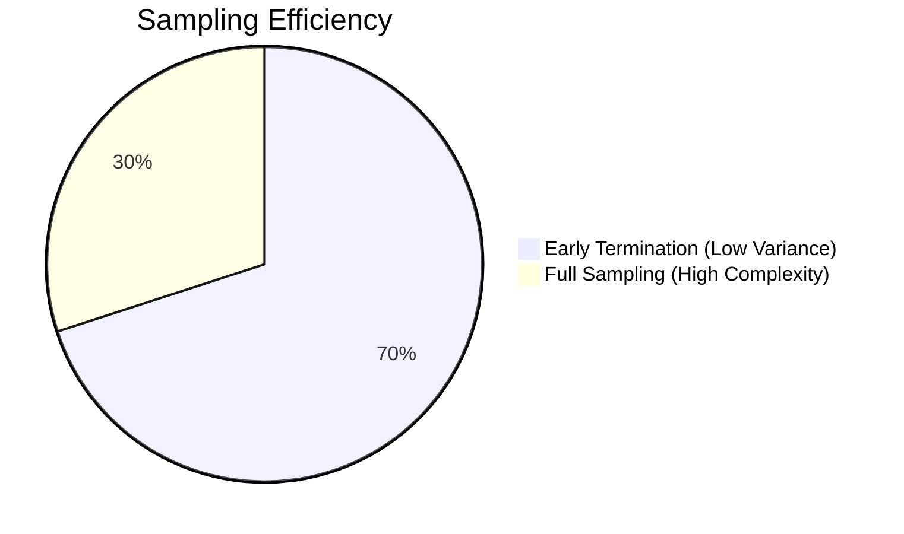

## Overview
In this project, I developed a physically-based ray tracer capable of simulating complex light transport. The implementation covered the entire rendering pipeline: ray generation, primitive intersection, acceleration structures (BVH), and advanced lighting techniques like Global Illumination and Adaptive Sampling.

> **Reflection:** I remember being visibly shocked at how much our rendering speed improved after BVH implementation. It’s fascinating how working through light simulation makes you think about light differently in the real world.

---

## Part 1: Ray Generation and Scene Intersection
To generate rays, we translate from image space to camera space to world space. We create a 3D vector at z = -1 in camera space and transform it into world space using the c2w matrix.

For triangle intersection, I implemented the **Möller-Trumbore Algorithm**, which solves for the intersection point using barycentric coordinates without needing to pre-calculate the plane equation.

| Lambertian Spheres | Utah Teapot | CBGems |
| :---: | :---: | :---: |
|  |  |  |

---

## Part 2: Bounding Volume Hierarchy (BVH)
For the BVH construction, we split nodes along the **longest axis** based on the centroid of the primitives' bounding boxes. This heuristic produces shallower trees and minimizes spatial overlap.

### Performance Comparison
| Scene | Without BVH | With BVH | Speedup |
| :--- | :--- | :--- | :--- |
| **Max Planck** | 189.89s | 0.09s | ~2100x |
| **CB Lucy** | 604.03s | 0.06s | ~10000x |
| **CB Dragon** | 431.17s | 0.23s | ~1800x |

*(Note: Rendered on an RTX 3080 with 10 threads).*

---

## Part 3: Direct Illumination
Direct lighting is the sum of zero-bounce and one-bounce radiance. I implemented two methods for one-bounce radiance:
1. **Uniform Hemisphere Sampling:** Uses a Monte Carlo estimator to sample outgoing rays.
2. **Importance Sampling:** Samples only directions pointing toward light sources, significantly reducing noise in soft shadows.

| Importance Sampling | Hemispherical Sampling |
| :---: | :---: |
|  |  |

---

## Part 4: Global Illumination
Global illumination accounts for indirect lighting—the subsequent bounces of light that complete an image. To prevent infinite recursion, I used **Russian Roulette** termination with a continuation probability p = 0.7.

$$L_{out} = L_{e} + \int_{\Omega} f_{r}(p, \hat{\omega}_{i}, \hat{\omega}_{o}) L_{i}(p, \hat{\omega}_{i}) n \cdot \hat{\omega}_{i} d\omega_{i}$$

| Direct Only | Indirect Only | Full Global Illumination |
| :---: | :---: | :---: |
|  |  |  |

---

## Part 5: Adaptive Sampling
Adaptive sampling dynamically adjusts the number of samples per pixel based on statistical confidence. Every samplesPerBatch, we calculate the mean and variance to check if the pixel has converged.

| Final Render | Sampling Rate Map |
| :---: | :---: |
|  |  |