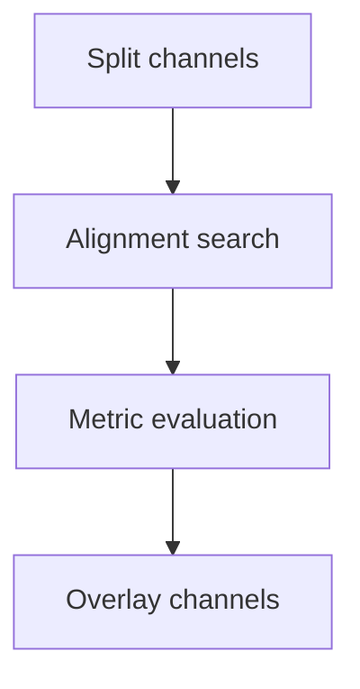
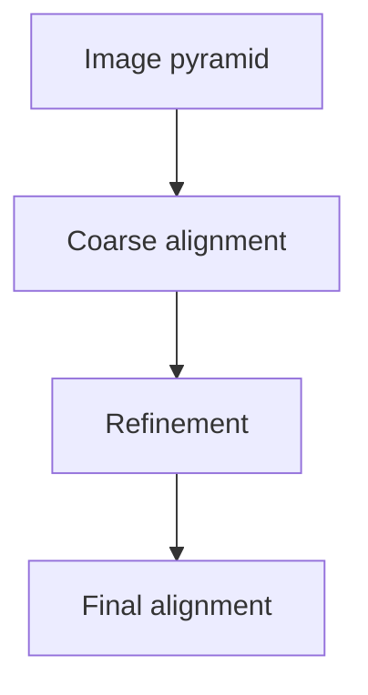

# Images of the Russian Empire

The Prokudin-Gorskii Photo Collection is a set of digitized glass plate images that are split into three different color channels: red, green, and blue.

---

## Part 1: Single-scale Alignment

| Monastery | Tobolsk |
| :---: | :---: |
|  |  |

---

## Cathedral - A special case

| Incorrect | Correct |
| :---: | :---: |
|  |  |

---

## Part 2: Multi-scale Pyramid Alignment

| Church | Harvesters |
| :---: | :---: |
|  |  |

| Self Portrait |
| :---: |
|  |

---

## Emir - A special case

| Incorrect | Correct |
| :---: | :---: |
|  |  |